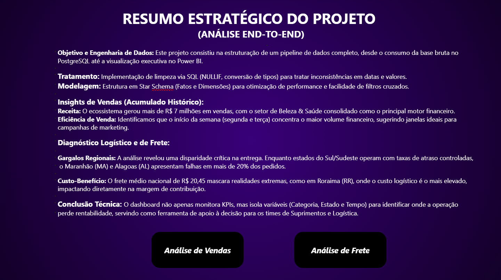
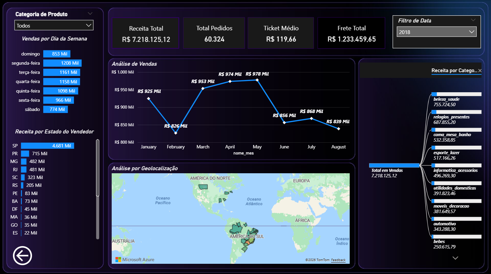
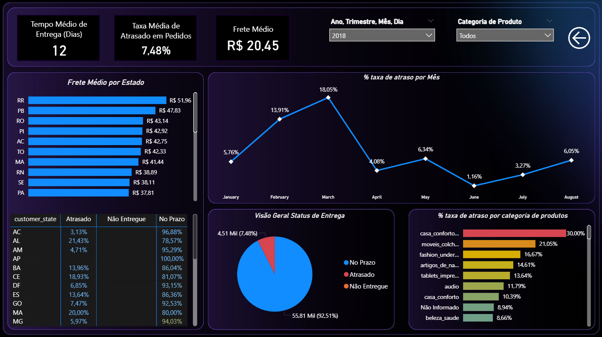

# 📊 Olist E-commerce Analytics 
Este projeto apresenta uma análise completa de dados do marketplace
brasileiro **Olist**, simulando um cenário real de trabalho de um
**Analista de Dados**.

O projeto cobre todo o fluxo analítico: desde a ingestão de dados brutos
até a construção de um **Data Warehouse modelado em Star Schema** e a
criação de **dashboards analíticos no Power BI**.

O objetivo é demonstrar habilidades práticas em:

-   Engenharia e modelagem de dados
-   Limpeza e transformação de dados com SQL
-   Construção de métricas de negócio
-   Análise exploratória de dados
-   Criação de dashboards analíticos
-   Geração de insights estratégicos

------------------------------------------------------------------------

# 🎯 Objetivo do Projeto

Empresas de **e-commerce** precisam monitorar constantemente:

-   desempenho de vendas
-   comportamento dos clientes
-   eficiência logística
-   custos de frete
-   atrasos nas entregas

Este projeto busca responder perguntas importantes de negócio, como:

-   Quais categorias geram mais receita?
-   Quais estados concentram o maior volume de vendas?
-   Existe sazonalidade nas vendas?
-   Como está a eficiência logística das entregas?
-   Quais regiões possuem maior custo de frete?

------------------------------------------------------------------------

# 🗂️ Fonte dos Dados

Dataset público disponível no Kaggle:

https://www.kaggle.com/datasets/olistbr/brazilian-ecommerce

O dataset contém dados reais de um marketplace brasileiro entre **2016 e
2018**.

Principais tabelas utilizadas:

  Tabela                         Descrição
  ------------------------------ --------------------------
  olist_customers_dataset        Informações dos clientes
  olist_orders_dataset           Dados dos pedidos
  olist_order_items_dataset      Itens de cada pedido
  olist_products_dataset         Informações dos produtos
  olist_sellers_dataset          Dados dos vendedores
  olist_order_payments_dataset   Informações de pagamento
  olist_order_reviews_dataset    Avaliações dos clientes

------------------------------------------------------------------------

# 🏗️ Arquitetura do Projeto

Pipeline de dados utilizado no projeto:

    Kaggle Dataset
          ↓
    PostgreSQL (Ingestão dos dados)
          ↓
    Limpeza e Transformação com SQL
          ↓
    Modelagem Dimensional (Star Schema)
          ↓
    Criação de Views Analíticas
          ↓
    Dashboard no Power BI

------------------------------------------------------------------------

# 🛠️ Tecnologias Utilizadas

-   **PostgreSQL** --- armazenamento e transformação de dados
-   **SQL** --- consultas analíticas e transformação
-   **DBeaver** --- gerenciamento do banco de dados
-   **Power BI** --- construção de dashboards
-   **Kaggle** --- fonte do dataset

------------------------------------------------------------------------

# 🧱 Modelagem de Dados (Star Schema)

Para otimizar consultas analíticas foi implementado um **modelo
dimensional utilizando Star Schema**.

Esse modelo melhora:

-   performance de consultas
-   organização do Data Warehouse
-   facilidade de análise no Power BI

O modelo é composto por:

-   1 tabela fato
-   4 tabelas dimensão

------------------------------------------------------------------------

# 📌 Tabela Fato

## `fact_order_items`

Tabela central do Data Warehouse que registra os eventos de venda.

Principais métricas:

-   `price` --- valor do produto
-   `freight_value` --- valor do frete
-   `tempo_entrega_dias` --- tempo de entrega em dias
-   `status_entrega` --- classificação da entrega

A tabela considera apenas pedidos com status:

``` sql
WHERE order_status = 'delivered'
```

Isso garante que apenas **vendas concluídas** sejam analisadas.

------------------------------------------------------------------------

# 📌 Dimensões

## `dim_clientes`

Contém informações geográficas dos clientes.

Campos principais:

-   customer_id
-   customer_city
-   customer_state

Total aproximado de registros: **99.441**

------------------------------------------------------------------------

## `dim_produtos`

Contém informações sobre os produtos vendidos.

Campos principais:

-   product_id
-   product_category_name
-   product_weight_g
-   product_length_cm
-   product_height_cm
-   product_width_cm

Total aproximado de registros: **32.951**

------------------------------------------------------------------------

## `dim_vendedores`

Contém dados de localização dos vendedores.

Campos principais:

-   seller_id
-   seller_city
-   seller_state

Total aproximado de registros: **3.095**

------------------------------------------------------------------------

## `dim_data`

Tabela calendário utilizada para análises temporais.

Campos principais:

-   ano
-   mes
-   nome_mes
-   trimestre
-   dia_semana_num

Total aproximado de registros: **612 datas**

------------------------------------------------------------------------

# 🔑 Surrogate Keys

Para melhorar a performance analítica e seguir boas práticas de **Data
Warehouse**, foram criadas **Surrogate Keys** nas tabelas dimensão.

Chaves utilizadas:

-   cliente_sk
-   produtos_sk
-   vendedores_sk
-   data_sk

A tabela fato utiliza apenas essas chaves para relacionamento entre
dimensões.

------------------------------------------------------------------------

# 🧹 Transformação dos Dados

Durante a preparação dos dados foram aplicadas várias transformações.

## Filtragem de Pedidos

Pedidos não concluídos foram removidos da análise.

``` sql
WHERE order_status = 'delivered'
```

Isso garante que apenas pedidos que realmente geraram receita sejam
considerados.

------------------------------------------------------------------------

## Engenharia de Métricas Logísticas

### Tempo de Entrega

Foi criada uma métrica para calcular o tempo entre a compra e a entrega.

``` sql
DATE(order_delivered_customer_date) - DATE(order_purchase_timestamp)
```

Essa métrica permite avaliar a eficiência logística do marketplace.

------------------------------------------------------------------------

### Status de Entrega

Foi criada uma classificação para avaliar a performance das entregas:

-   No Prazo
-   Atrasado
-   Não Entregue

Essa classificação é obtida comparando:

-   data real de entrega
-   data estimada de entrega

------------------------------------------------------------------------

# 📊 Views Analíticas

Para facilitar o consumo dos dados no **Power BI**, foram criadas views
analíticas.

## `vw_geral_vendas`

Base principal utilizada no dashboard.

Contém:

-   valor da venda
-   valor do frete
-   estado do cliente
-   estado do vendedor
-   categoria do produto
-   ano e mês

------------------------------------------------------------------------

## `vw_vendas_categoria`

Permite analisar o desempenho de vendas por categoria.

Métricas:

-   quantidade de vendas
-   receita total
-   ticket médio
-   frete total

------------------------------------------------------------------------

## `vw_analise_geografica`

Permite análises regionais de vendas.

Métricas:

-   quantidade de clientes
-   receita por região
-   ticket médio por estado

------------------------------------------------------------------------

## `vw_vendas_tempo`

Permite análise temporal das vendas.

Métricas:

-   vendas por mês
-   receita mensal
-   trimestre

------------------------------------------------------------------------

# 📊 Dashboard
## 🖥️ Dashboard Interativo

O projeto foi publicado no Power BI Service para permitir a exploração interativa dos dados. 

🔗 **[Clique aqui para acessar o Dashboard Online](https://app.powerbi.com/view?r=eyJrIjoiMTMxYjJjMDQtNTY1MC00OWM5LWEwM2ItZmM4Yzk4ZGU1YTgxIiwidCI6IjgzMGVjNGJhLWUzNTYtNDM2Zi05NGQzLWU3NGQ1OGU1OTE4OSJ9)**

---

### 📸 Screenshots das Visões

#### 1. Resumo Estratégico (Home)
Menu de navegação com o sumário técnico do projeto.


#### 2. Análise de Vendas
Visão focada em faturamento, Ticket Médio e performance por categoria.


#### 3. Análise de Logística e Frete
Diagnóstico de gargalos de entrega e custos operacionais por região.


O dashboard foi desenvolvido no **Power BI** e dividido em duas áreas
principais.

## 📈 Análise de Vendas

Principais indicadores:

-   Receita Total
-   Total de Pedidos
-   Ticket Médio
-   Frete Total

Análises disponíveis:

-   vendas por dia da semana
-   vendas por categoria
-   vendas por estado
-   evolução mensal de vendas

------------------------------------------------------------------------

## 🚚 Análise Logística

Principais indicadores:

-   Tempo médio de entrega
-   Frete médio
-   Taxa de atraso de pedidos

Análises disponíveis:

-   atraso por mês
-   atraso por categoria
-   custo de frete por estado
-   status de entrega

------------------------------------------------------------------------

# 🔎 Principais Insights

Principais descobertas da análise:

-   O marketplace gerou **mais de R\$ 7 milhões em vendas** no período
    analisado.
-   A categoria **Beleza & Saúde** foi a principal responsável pela
    receita total.
-   **Segunda-feira e terça-feira** concentram grande parte do volume de
    pedidos.
-   Estados da **região Norte** apresentam custos logísticos mais
    elevados.
-   Algumas categorias apresentam **taxas de atraso superiores a 20%**,
    indicando possíveis gargalos logísticos.

------------------------------------------------------------------------

# 🚀 Possíveis Melhorias Futuras

-   Construção de pipeline ETL automatizado
-   Uso de ferramentas de orquestração como Airflow
-   Deploy do Data Warehouse em ambiente cloud
-   Criação de dashboards adicionais focados em retenção de clientes
-   Aplicação de modelos de previsão de vendas

------------------------------------------------------------------------

# 👨‍💻 Autor

Projeto desenvolvido como parte de estudos em **Data Analytics e
Engenharia de Dados**, aplicando conceitos reais de mercado em um
dataset público.
